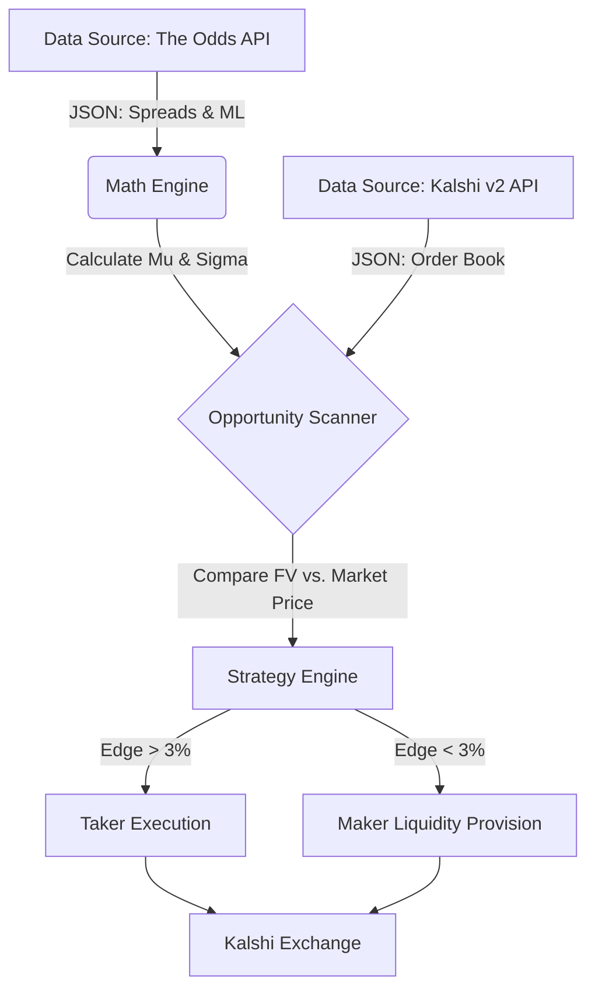

# Hodge-Vegas: Statistical Arbitrage & Liquidity Engine 🏛️ 🎲


## 📖 Executive Summary

**Hodge-Vegas** is a quantitative trading system designed to bridge the efficiency gap between mature sportsbooks (e.g., DraftKings, Vegas) and the emerging prediction market ecosystem (Kalshi).

By treating highly liquid sportsbook odds as the "ground truth," this engine utilizes a **Gaussian Physics Model** to derive the implied fair value of binary contracts. It then autonomously acts as a **Market Maker** or **Liquidity Taker** on Kalshi to enforce pricing efficiency and capture statistical arbitrage opportunities.

> **Note:** This project was developed as a proposal for the **Kalshi Developer Grant**, aiming to solve liquidity fragmentation and pricing latency in long-tail prediction markets.

---

## 💡 The Core Problem & Solution

### The Problem: Pricing Inefficiency
Prediction markets like Kalshi often suffer from **retail sentiment bias** and **low liquidity**, especially in non-headline events (e.g., regular season NBA games). This results in:
1.  **Wide Bid-Ask Spreads:** Making entry/exit costly.
2.  **Pricing Latency:** Prices fail to react instantly to real-world game developments compared to liquid sportsbooks.

### The Solution: Cross-Market Arbitrage
Hodge-Vegas acts as an **Oracle Bridge**:
1.  **Ingest:** Real-time odds (Moneyline & Point Spreads) from Vegas bookmakers.
2.  **Transform:** Convert these traditional odds into a **Binary Probability Density Function (PDF)**.
3.  **Execute:** algorithmic trading on Kalshi to align the binary price with the true mathematical probability.

---

## 🧮 Mathematical Framework

This engine leverages two distinct mathematical models to identify pricing inefficiencies:

### 1. The Gaussian Physics Model (Local Pricing)
Used for single-game arbitrage. We model the score differential ($X$) as:
$$X \sim \mathcal{N}(\mu, \sigma^2)$$
Parameters ($\mu, \sigma$) are derived by back-solving the Z-scores from Vegas Moneyline and Spread data.

### 2. Discrete Hodge Decomposition (Global Consistency)
Used to identify **Cyclic Arbitrage** and structural market inefficiencies.

By representing the market as a graph where teams are nodes and spreads are edge flows ($Y_{ij}$), we apply **Discrete Hodge Theory** to decompose the observed betting flow:

$$Y = Y_{gradient} + Y_{curl}$$

* **$Y_{gradient}$ (Gradient Flow):** The "Global Potential" (True Strength). This represents the consistent ranking component $s$, such that $Y_{ij} \approx s_j - s_i$.
* **$Y_{curl}$ (Curl Flow):** The "Cyclic Component" (Inconsistency).
    $$\text{Curl} = Y - \text{grad}(s)$$

**The Strategy:**
When the **$L^2$-norm of the Curl component** ($||Y_{curl}||^2$) spikes, it indicates that the betting market contains internal contradictions (e.g., $A > B > C > A$). The engine flags these regimes as "High Volatility/High Opportunity" states, triggering more aggressive taker execution.

---

## 🏗️ System Architecture



---

## 🚀 Installation & Usage Guide
### 1. Environment Setup
Ensure you have Python 3.9+ installed.

```Bash
# Clone the repository
git clone [https://github.com/yourusername/hodge-vegas.git](https://github.com/yourusername/hodge-vegas.git)
cd hodge-vegas

# Install required dependencies
pip install -r requirements.txt
```

### 2. Security & Credentials Configuration (Crucial)
This engine requires API access to both The Odds API (for "Ground Truth" data) and Kalshi (for execution).

#### Step A: Create the API Key File Create a file named apikeys.key in the root directory. This file is strictly for local use and is added to .gitignore to prevent leakage.

Content of apikeys.key:

```Ini, TOML

ODDS_API_KEY="your_odds_api_key_here"
KALSHI_KEY_ID="your_kalshi_key_id_here"
```
#### Step B: RSA Private Key Kalshi v2 API requires RSA-4096 signature authentication.

Generate your RSA key pair via OpenSSL or Kalshi's dashboard.

Save your Private Key as seckey.key in the root directory.

🔒 Security Note: The .gitignore file is pre-configured to exclude *.key files. Never commit your private keys to GitHub.

### 3. Execution Modes
The engine supports two modes, controlled via src/main.py:

🧪 Simulation Mode (DRY_RUN = True):

Scans the market and calculates Fair Value.

Logs "Simulated Orders" to the console without sending API requests.

Recommended for backtesting and logic verification.

💸 Live Trading Mode (DRY_RUN = False):

Connects to the Kalshi Mainnet (api.kalshi.com).

Executes real-money limit orders when ROI > Threshold.

Requires a funded Kalshi account.

### 4. Running the Engine
To start the scanning loop:

```Bash

python src/main.py
```

Expected Console Output:

```Plaintext

🚀 STARTING HODGE-VEGAS ENGINE...
📡 Fetching Vegas Consensus Data...
📡 Scanning Kalshi Order Book...
------------------------------------------------------------
[OPPORTUNITY DETECTED]
Event: NBA - Lakers vs Warriors
Strategy: TAKER (Buy YES)
Implied Probability (Vegas): 65.4%
Market Price (Kalshi): 52.0¢
Edge: +13.4%  |  ROI: 25.7%
✅ EXECUTING: BUY 100x @ 52¢
------------------------------------------------------------
```

## 📂 Project Structure
```Plaintext

Hodge-Vegas/
├── src/
│   ├── __init__.py          # Package initialization
│   ├── main.py              # Entry point and orchestration logic
│   └── math_engine.py       # Gaussian statistical modeling
├── requirements.txt         # Dependencies (pandas, scipy, cryptography, etc.)
├── .gitignore               # Security rules (excludes keys and venv)
└── README.md                # Documentation
```

---

## 📜 Disclaimer
This software is for educational and research purposes. Quantitative trading involves significant financial risk. The author is not responsible for financial losses incurred by using this software.